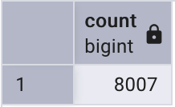
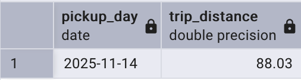
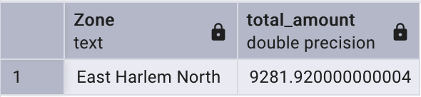
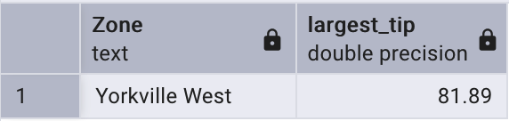

# Module 1 Homework: Docker & SQL

In this homework we'll prepare the environment and practice
Docker and SQL

When submitting your homework, you will also need to include
a link to your GitHub repository or other public code-hosting
site.

This repository should contain the code for solving the homework.

When your solution has SQL or shell commands and not code
(e.g. python files) file format, include them directly in
the README file of your repository.


## Question 1. Understanding Docker images

Run docker with the `python:3.13` image. Use an entrypoint `bash` to interact with the container.

What's the version of `pip` in the image?

- 25.3
- 24.3.1
- 24.2.1
- 23.3.1

### Solution

```bash
$ docker run --rm python:3.13 bash -c "pip --version"
pip 25.3 from /usr/local/lib/python3.13/site-packages/pip (python 3.13)
```

**Answer**: 25.3


## Question 2. Understanding Docker networking and docker-compose

Given the following `docker-compose.yaml`, what is the `hostname` and `port` that pgadmin should use to connect to the postgres database?

```yaml
services:
  db:
    container_name: postgres
    image: postgres:17-alpine
    environment:
      POSTGRES_USER: 'postgres'
      POSTGRES_PASSWORD: 'postgres'
      POSTGRES_DB: 'ny_taxi'
    ports:
      - '5433:5432'
    volumes:
      - vol-pgdata:/var/lib/postgresql/data

  pgadmin:
    container_name: pgadmin
    image: dpage/pgadmin4:latest
    environment:
      PGADMIN_DEFAULT_EMAIL: "pgadmin@pgadmin.com"
      PGADMIN_DEFAULT_PASSWORD: "pgadmin"
    ports:
      - "8080:80"
    volumes:
      - vol-pgadmin_data:/var/lib/pgadmin

volumes:
  vol-pgdata:
    name: vol-pgdata
  vol-pgadmin_data:
    name: vol-pgadmin_data
```

- postgres:5433
- localhost:5432
- db:5433
- postgres:5432
- db:5432

If multiple answers are correct, select any

### Solution

Testing connections from inside the pgadmin container using `nc -zvv` (double verbose shows connection refused errors):

```bash
$ docker exec pgadmin sh -c "nc -zvv postgres 5433"
nc: postgres (172.20.0.3:5433): Connection refused
sent 0, rcvd 0

$ docker exec pgadmin sh -c "nc -zvv localhost 5432"
nc: localhost ([::1]:5432): Connection refused
sent 0, rcvd 0

$ docker exec pgadmin sh -c "nc -zvv db 5433"
nc: db (172.20.0.3:5433): Connection refused
sent 0, rcvd 0

$ docker exec pgadmin sh -c "nc -zvv postgres 5432"
postgres (172.20.0.3:5432) open
sent 0, rcvd 0

$ docker exec pgadmin sh -c "nc -zvv db 5432"
db (172.20.0.3:5432) open
sent 0, rcvd 0
```

Both `db:5432` and `postgres:5432` work:
- Service name is `db` (from docker-compose.yaml)
- Container name is `postgres` (also resolves in Docker DNS)
- Containers communicate via internal port `5432` (not host-mapped `5433`)

**Answer**: db:5432 and postgres:5432


## Prepare the Data

### Download datasets

Download the green taxi trips data for November 2025:

```bash
wget https://d37ci6vzurychx.cloudfront.net/trip-data/green_tripdata_2025-11.parquet
```

You will also need the dataset with zones:

```bash
wget https://github.com/DataTalksClub/nyc-tlc-data/releases/download/misc/taxi_zone_lookup.csv
```

### Load data into PostgreSQL

The `ingest_data.py` script uses uv's inline dependency management (PEP 723), Polars for fast data processing, and ADBC for efficient database connectivity. Dependencies are declared in the script header and automatically installed when you run it:

```bash
$ uv run ingest_data.py --pg-host localhost --pg-port 5433
Loading green taxi data from data/green_tripdata_2025-11.parquet...
Loaded 46912 green taxi records
Loading zones from data/taxi_zone_lookup.csv...
Loaded 265 zone records
```

Make sure the PostgreSQL container is running first (`docker-compose up -d`).

## Question 3. Counting short trips

For the trips in November 2025 (lpep_pickup_datetime between '2025-11-01' and '2025-12-01', exclusive of the upper bound), how many trips had a `trip_distance` of less than or equal to 1 mile?

- 7,853
- 8,007
- 8,254
- 8,421

### Solution

**Query in pgAdmin**:
```sql
SELECT
    COUNT(*)
FROM
    GREEN_TAXI_DATA
WHERE
    '2025-11-01' <= LPEP_PICKUP_DATETIME
    AND LPEP_PICKUP_DATETIME < '2025-12-01'
    AND TRIP_DISTANCE <= 1;
```

**Result**:



**Answer**: 8,007


## Question 4. Longest trip for each day

Which was the pick up day with the longest trip distance? Only consider trips with `trip_distance` less than 100 miles (to exclude data errors).

Use the pick up time for your calculations.

- 2025-11-14
- 2025-11-20
- 2025-11-23
- 2025-11-25

### Solution

**Query in pgAdmin**:
```sql
SELECT
    DATE(LPEP_PICKUP_DATETIME) AS PICKUP_DAY,
    TRIP_DISTANCE
FROM
    GREEN_TAXI_DATA
WHERE
    TRIP_DISTANCE < 100
ORDER BY
    TRIP_DISTANCE DESC
LIMIT
    1;
```

**Result**:



**Answer**: 2025-11-14


## Question 5. Biggest pickup zone

Which was the pickup zone with the largest `total_amount` (sum of all trips) on November 18th, 2025?

- East Harlem North
- East Harlem South
- Morningside Heights
- Forest Hills

### Solution

**Query in pgAdmin**:
```sql
SELECT
    Z."Zone",
    SUM(T.TOTAL_AMOUNT) AS TOTAL_AMOUNT
FROM
    GREEN_TAXI_DATA T
    JOIN ZONES Z ON Z."LocationID" = T."PULocationID"
WHERE
    DATE(T.LPEP_PICKUP_DATETIME) = '2025-11-18'
GROUP BY
    1
ORDER BY
    2 DESC
LIMIT
    1;
```

**Result**:



**Answer**: East Harlem North


## Question 6. Largest tip

For the passengers picked up in the zone named "East Harlem North" in November 2025, which was the drop off zone that had the largest tip?

Note: it's `tip` , not `trip`. We need the name of the zone, not the ID.

- JFK Airport
- Yorkville West
- East Harlem North
- LaGuardia Airport

### Solution

**Query in pgAdmin**:
```sql
SELECT
    DOZ."Zone",
    MAX(T.TIP_AMOUNT) AS LARGEST_TIP
FROM
    GREEN_TAXI_DATA T
    JOIN ZONES PUZ ON PUZ."LocationID" = T."PULocationID"
    JOIN ZONES DOZ ON DOZ."LocationID" = T."DOLocationID"
WHERE
    PUZ."Zone" = 'East Harlem North'
GROUP BY
    1
ORDER BY
    2 DESC
LIMIT
    1;
```

**Result**:



**Answer**: Yorkville West


## Terraform

In this section homework we'll prepare the environment by creating resources in GCP with Terraform.

In your VM on GCP/Laptop/GitHub Codespace install Terraform.
Copy the files from the course repo
[here](../../../01-docker-terraform/terraform/terraform) to your VM/Laptop/GitHub Codespace.

Modify the files as necessary to create a GCP Bucket and Big Query Dataset.


## Question 7. Terraform Workflow

Which of the following sequences, respectively, describes the workflow for:
1. Downloading the provider plugins and setting up backend,
2. Generating proposed changes and auto-executing the plan
3. Remove all resources managed by terraform`

Answers:
- terraform import, terraform apply -y, terraform destroy
- teraform init, terraform plan -auto-apply, terraform rm
- terraform init, terraform run -auto-approve, terraform destroy
- terraform init, terraform apply -auto-approve, terraform destroy
- terraform import, terraform apply -y, terraform rm

### Solution

**Answer**: terraform init, terraform apply -auto-approve, terraform destroy

- `terraform init` downloads provider plugins and sets up backend
- `terraform apply -auto-approve` generates plan and auto-executes without confirmation
- `terraform destroy` removes all terraform-managed resources


## Submitting the solutions

* Form for submitting: https://courses.datatalks.club/de-zoomcamp-2026/homework/hw1


## Learning in Public

We encourage everyone to share what they learned. This is called "learning in public".

### Why learn in public?

- Accountability: Sharing your progress creates commitment and motivation to continue
- Feedback: The community can provide valuable suggestions and corrections
- Networking: You'll connect with like-minded people and potential collaborators
- Documentation: Your posts become a learning journal you can reference later
- Opportunities: Employers and clients often discover talent through public learning

You can read more about the benefits [here](https://alexeyondata.substack.com/p/benefits-of-learning-in-public-and).

Don't worry about being perfect. Everyone starts somewhere, and people love following genuine learning journeys!

### Example post for LinkedIn

```
🚀 Week 1 of Data Engineering Zoomcamp by @DataTalksClub complete!

Just finished Module 1 - Docker & Terraform. Learned how to:

✅ Containerize applications with Docker and Docker Compose
✅ Set up PostgreSQL databases and write SQL queries
✅ Build data pipelines to ingest NYC taxi data
✅ Provision cloud infrastructure with Terraform

Here's my homework solution: <LINK>

Following along with this amazing free course - who else is learning data engineering?

You can sign up here: https://github.com/DataTalksClub/data-engineering-zoomcamp/
```

### Example post for Twitter/X


```
🐳 Module 1 of Data Engineering Zoomcamp done!

- Docker containers
- Postgres & SQL
- Terraform & GCP
- NYC taxi data pipeline

My solution: <LINK>

Free course by @DataTalksClub: https://github.com/DataTalksClub/data-engineering-zoomcamp/
```
