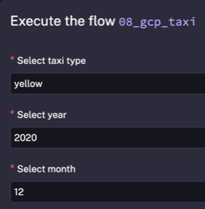
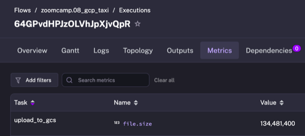
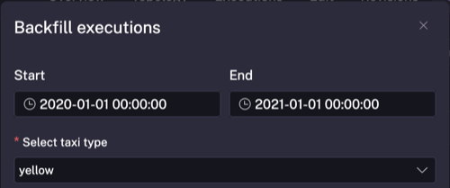
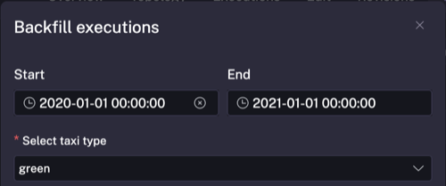
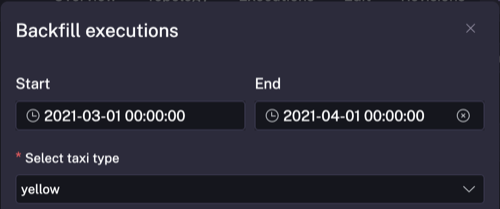

## Module 2 Homework

ATTENTION: At the end of the submission form, you will be required to include a link to your GitHub repository or other public code-hosting site. This repository should contain your code for solving the homework. If your solution includes code that is not in file format, please include these directly in the README file of your repository.

> In case you don't get one option exactly, select the closest one 

For the homework, we'll be working with the _green_ taxi dataset located here:

`https://github.com/DataTalksClub/nyc-tlc-data/releases/tag/green/download`

To get a `wget`-able link, use this prefix (note that the link itself gives 404):

`https://github.com/DataTalksClub/nyc-tlc-data/releases/download/green/`

### Assignment

So far in the course, we processed data for the year 2019 and 2020. Your task is to extend the existing flows to include data for the year 2021.


As a hint, Kestra makes that process really easy:
1. You can leverage the backfill functionality in the [scheduled flow](../../../02-workflow-orchestration/flows/09_gcp_taxi_scheduled.yaml) to backfill the data for the year 2021. Just make sure to select the time period for which data exists i.e. from `2021-01-01` to `2021-07-31`. Also, make sure to do the same for both `yellow` and `green` taxi data (select the right service in the `taxi` input).
2. Alternatively, run the flow manually for each of the seven months of 2021 for both `yellow` and `green` taxi data. Challenge for you: find out how to loop over the combination of Year-Month and `taxi`-type using `ForEach` task which triggers the flow for each combination using a `Subflow` task.

### Quiz Questions

Complete the quiz shown below. It's a set of 6 multiple-choice questions to test your understanding of workflow orchestration, Kestra, and ETL pipelines.

1) Within the execution for `Yellow` Taxi data for the year `2020` and month `12`: what is the uncompressed file size (i.e. the output file `yellow_tripdata_2020-12.csv` of the `extract` task)?
- 128.3 MiB
- 134.5 MiB
- 364.7 MiB
- 692.6 MiB

### Solution

Run flow `08_gcp_taxi` with the following inputs:



Check the Metrics tab for the `upload_to_gcs` task:



File size: **134,481,400 bytes** = 134,481,400 / (1024 * 1024) = **128.25 MiB**

**Answer**: 128.3 MiB

2) What is the rendered value of the variable `file` when the inputs `taxi` is set to `green`, `year` is set to `2020`, and `month` is set to `04` during execution?
- `{{inputs.taxi}}_tripdata_{{inputs.year}}-{{inputs.month}}.csv`
- `green_tripdata_2020-04.csv`
- `green_tripdata_04_2020.csv`
- `green_tripdata_2020.csv`

### Solution

From flow `08_gcp_taxi.yaml` line 27:

```yaml
variables:
  file: "{{inputs.taxi}}_tripdata_{{inputs.year}}-{{inputs.month}}.csv"
```

With `taxi=green`, `year=2020`, `month=04`, this renders to `green_tripdata_2020-04.csv`

**Answer**: green_tripdata_2020-04.csv

3) How many rows are there for the `Yellow` Taxi data for all CSV files in the year 2020?
- 13,537.299
- 24,648,499
- 18,324,219
- 29,430,127

### Solution

**Authentication Setup:**

Authenticate with GCP using the service account credentials:

```bash
gcloud auth activate-service-account --key-file=../01-docker-terraform/terrademo/keys/terraform-demo-putopavel-1c49266c2d77.json
gcloud config set project terraform-demo-putopavel
```

This gives the `bq` and `gsutil` CLIs access to GCP resources.

**Data Ingestion:**

Backfilled flow `09_gcp_taxi_scheduled` with `taxi=yellow` from 2020-01-01 to 2021-01-01:



**Verification - BigQuery query:**

```bash
$ bq query --nouse_legacy_sql '
SELECT COUNT(*) as total_rows
FROM `terraform-demo-putopavel.zoomcamp_putopavel_kestra.yellow_tripdata`
WHERE filename LIKE "yellow_tripdata_2020-%"
'
+------------+
| total_rows |
+------------+
|   24648499 |
+------------+
```

**Answer**: 24,648,499

4) How many rows are there for the `Green` Taxi data for all CSV files in the year 2020?
- 5,327,301
- 936,199
- 1,734,051
- 1,342,034

### Solution

**Data Ingestion:**

Backfilled flow `09_gcp_taxi_scheduled` with `taxi=green` from 2020-01-01 to 2021-01-01:



**Verification - BigQuery query:**

```bash
$ bq query --nouse_legacy_sql '
SELECT COUNT(*) as total_rows
FROM `terraform-demo-putopavel.zoomcamp_putopavel_kestra.green_tripdata`
WHERE filename LIKE "green_tripdata_2020-%"
'
+------------+
| total_rows |
+------------+
|    1734051 |
+------------+
```

**Answer**: 1,734,051

5) How many rows are there for the `Yellow` Taxi data for the March 2021 CSV file?
- 1,428,092
- 706,911
- 1,925,152
- 2,561,031

### Solution

**Data Ingestion:**

Backfilled flow `09_gcp_taxi_scheduled` with `taxi=yellow` for March 2021:



**Verification - BigQuery query:**

```bash
$ bq query --nouse_legacy_sql '
SELECT COUNT(*) as total_rows
FROM `terraform-demo-putopavel.zoomcamp_putopavel_kestra.yellow_tripdata`
WHERE filename LIKE "yellow_tripdata_2021-03%"
'
+------------+
| total_rows |
+------------+
|    1925152 |
+------------+
```

**Answer**: 1,925,152

6) How would you configure the timezone to New York in a Schedule trigger?
- Add a `timezone` property set to `EST` in the `Schedule` trigger configuration
- Add a `timezone` property set to `America/New_York` in the `Schedule` trigger configuration
- Add a `timezone` property set to `UTC-5` in the `Schedule` trigger configuration
- Add a `location` property set to `New_York` in the `Schedule` trigger configuration

### Solution

From the [Kestra Schedule Trigger documentation](https://kestra.io/plugins/core/triggers/io.kestra.plugin.core.trigger.schedule):

> "The time zone identifier (i.e. the second column in the Wikipedia table) to use for evaluating the cron expression."

Example:

```yaml
triggers:
  - id: schedule_example
    type: io.kestra.plugin.core.trigger.Schedule
    cron: "0 9 1 * *"
    timezone: America/New_York
```

The `timezone` property uses identifiers from the [Wikipedia TZ database list](https://en.wikipedia.org/wiki/List_of_tz_database_time_zones) (second column). Default is `Etc/UTC`.

**Answer**: Add a `timezone` property set to `America/New_York` in the `Schedule` trigger configuration

## Submitting the solutions

* Form for submitting: https://courses.datatalks.club/de-zoomcamp-2026/homework/hw2
* Check the link above to see the due date

## Solution

Will be added after the due date


## Learning in Public

We encourage everyone to share what they learned. This is called "learning in public".

Read more about the benefits [here](https://alexeyondata.substack.com/p/benefits-of-learning-in-public-and).

### Example post for LinkedIn

```
🚀 Week 2 of Data Engineering Zoomcamp by @DataTalksClub and @Will Russell complete!

Just finished Module 2 - Workflow Orchestration with @Kestra. Learned how to:

✅ Orchestrate data pipelines with Kestra flows
✅ Use variables and expressions for dynamic workflows
✅ Implement backfill for historical data
✅ Schedule workflows with timezone support
✅ Process NYC taxi data (Yellow & Green) for 2019-2021

Built ETL pipelines that extract, transform, and load taxi trip data automatically!

Thanks to the @Kestra team for the great orchestration tool!

Here's my homework solution: <LINK>

Following along with this amazing free course - who else is learning data engineering?

You can sign up here: https://github.com/DataTalksClub/data-engineering-zoomcamp/
```

### Example post for Twitter/X

```
Module 2 of DE Zoomcamp by @DataTalksClub @wrussell1999 done!

- @kestra_io workflow orchestration
- ETL pipelines for taxi data
- Backfill & scheduling
- Variables & dynamic flows

My solution: <LINK>

Join me here: https://github.com/DataTalksClub/data-engineering-zoomcamp/
```
