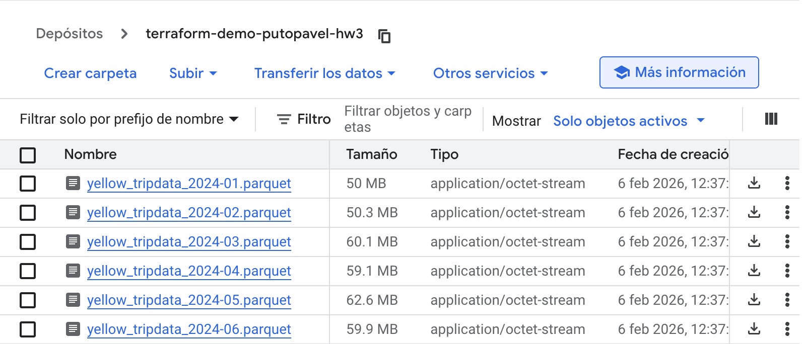
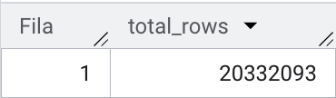
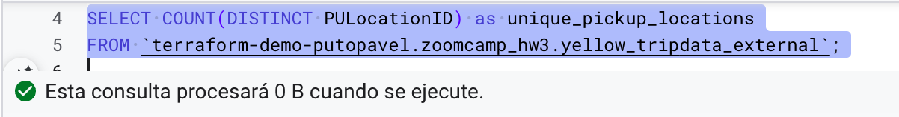
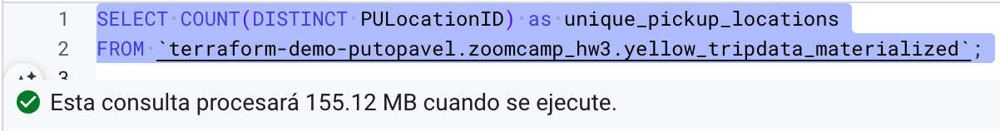
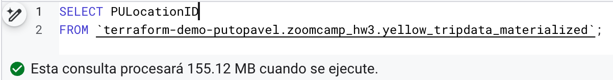
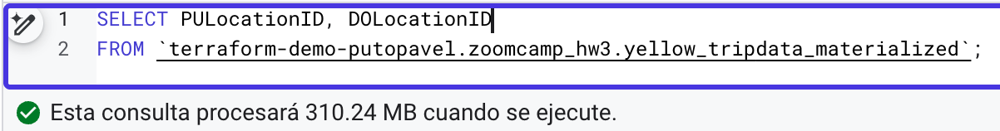
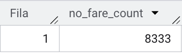
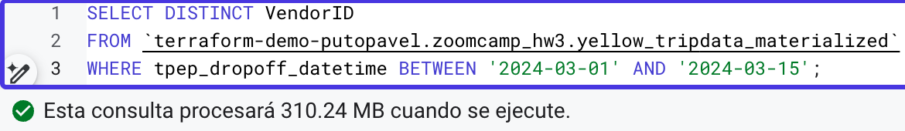
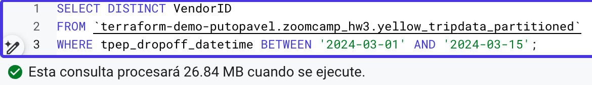

# Module 3 Homework: Data Warehousing & BigQuery

In this homework we'll practice working with BigQuery and Google Cloud Storage.

When submitting your homework, you will also need to include
a link to your GitHub repository or other public code-hosting
site.

This repository should contain the code for solving the homework.

When your solution has SQL or shell commands and not code
(e.g. python files) file format, include them directly in
the README file of your repository.

## Data

For this homework we will be using the Yellow Taxi Trip Records for January 2024 - June 2024 (not the entire year of data).

Parquet Files are available from the New York City Taxi Data found here:

https://www.nyc.gov/site/tlc/about/tlc-trip-record-data.page

## Loading the data

You can use the following scripts to load the data into your GCS bucket:

- Python script: [load_yellow_taxi_data.py](./load_yellow_taxi_data.py)
- Jupyter notebook with DLT: [DLT_upload_to_GCP.ipynb](./DLT_upload_to_GCP.ipynb)

You will need to generate a Service Account with GCS Admin privileges or be authenticated with the Google SDK, and update the bucket name in the script.

If you are using orchestration tools such as Kestra, Mage, Airflow, or Prefect, do not load the data into BigQuery using the orchestrator.

Make sure that all 6 files show in your GCS bucket before beginning.

Note: You will need to use the PARQUET option when creating an external table.


## BigQuery Setup

Create an external table using the Yellow Taxi Trip Records.

Create a (regular/materialized) table in BQ using the Yellow Taxi Trip Records (do not partition or cluster this table).

### Solution: Setup

**Step 1: Load data to GCS**

Used the Python script [load_yellow_taxi_data.py](./load_yellow_taxi_data.py) to download and upload 6 months of Yellow Taxi parquet files to GCS bucket `terraform-demo-putopavel-hw3`:

```bash
./load_yellow_taxi_data.py
```

Verified all 6 files in GCS bucket:



**Step 2: Create BigQuery Dataset**

Created dataset `zoomcamp_hw3` in region `europe-southwest1` (Madrid).

**Step 3: Create External Table**

```sql
CREATE EXTERNAL TABLE `terraform-demo-putopavel.zoomcamp_hw3.yellow_tripdata_external`
OPTIONS (
  format = "PARQUET",
  uris = ["gs://terraform-demo-putopavel-hw3/yellow_tripdata_2024-*.parquet"]
);
```

**Step 4: Create Materialized Table**

```sql
CREATE OR REPLACE TABLE `terraform-demo-putopavel.zoomcamp_hw3.yellow_tripdata_materialized` AS
SELECT * FROM `terraform-demo-putopavel.zoomcamp_hw3.yellow_tripdata_external`;
```


## Question 1. Counting records

What is count of records for the 2024 Yellow Taxi Data?
- 65,623
- 840,402
- 20,332,093
- 85,431,289

### Solution

Query:
```sql
SELECT COUNT(*) as total_rows
FROM `terraform-demo-putopavel.zoomcamp_hw3.yellow_tripdata_materialized`;
```

Result:



**Total rows**: 20,332,093

Note: This query estimates 0 B to process because `COUNT(*)` only reads table metadata, not the actual data:


**Answer**: 20,332,093


## Question 2. Data read estimation

Write a query to count the distinct number of PULocationIDs for the entire dataset on both the tables.

What is the **estimated amount** of data that will be read when this query is executed on the External Table and the Table?

- 18.82 MB for the External Table and 47.60 MB for the Materialized Table
- 0 MB for the External Table and 155.12 MB for the Materialized Table
- 2.14 GB for the External Table and 0MB for the Materialized Table
- 0 MB for the External Table and 0MB for the Materialized Table

### Solution

Query used:
```sql
SELECT COUNT(DISTINCT PULocationID) as unique_pickup_locations
FROM `terraform-demo-putopavel.zoomcamp_hw3.yellow_tripdata_external`;
-- FROM `terraform-demo-putopavel.zoomcamp_hw3.yellow_tripdata_materialized`;
```

**External Table**: 0 MB estimated



**Materialized Table**: 155.12 MB estimated



**Answer**: 0 MB for the External Table and 155.12 MB for the Materialized Table


## Question 3. Understanding columnar storage

Write a query to retrieve the PULocationID from the table (not the external table) in BigQuery. Now write a query to retrieve the PULocationID and DOLocationID on the same table.

Why are the estimated number of Bytes different?
- BigQuery is a columnar database, and it only scans the specific columns requested in the query. Querying two columns (PULocationID, DOLocationID) requires 
reading more data than querying one column (PULocationID), leading to a higher estimated number of bytes processed.
- BigQuery duplicates data across multiple storage partitions, so selecting two columns instead of one requires scanning the table twice, 
doubling the estimated bytes processed.
- BigQuery automatically caches the first queried column, so adding a second column increases processing time but does not affect the estimated bytes scanned.
- When selecting multiple columns, BigQuery performs an implicit join operation between them, increasing the estimated bytes processed

### Solution

Queries:
```sql
SELECT PULocationID --, DOLocationID
FROM `terraform-demo-putopavel.zoomcamp_hw3.yellow_tripdata_materialized`;
```


**Estimate**: 155.12 MB


**Estimate**: 310.24 MB

The estimate doubles (155 → 310 MB) because BigQuery stores data by column, not by row. When you query `PULocationID`, BigQuery only reads that column's data. Add `DOLocationID` and it reads both columns - roughly twice the data.

This is different from row-based databases where reading any field means scanning the whole row. In BigQuery, each column is stored separately, so you only pay for what you actually query.

**Answer**: BigQuery is a columnar database, and it only scans the specific columns requested in the query. Querying two columns (PULocationID, DOLocationID) requires reading more data than querying one column (PULocationID), leading to a higher estimated number of bytes processed.


## Question 4. Counting zero fare trips

How many records have a fare_amount of 0?
- 128,210
- 546,578
- 20,188,016
- 8,333

### Solution

```sql
SELECT COUNT(*) as no_fare_count
FROM `terraform-demo-putopavel.zoomcamp_hw3.yellow_tripdata_materialized`
WHERE fare_amount = 0;
```

**Result**: 8,333



**Answer**: 8,333


## Question 5. Partitioning and clustering

What is the best strategy to make an optimized table in Big Query if your query will always filter based on tpep_dropoff_datetime and order the results by VendorID (Create a new table with this strategy)

- Partition by tpep_dropoff_datetime and Cluster on VendorID
- Cluster on by tpep_dropoff_datetime and Cluster on VendorID
- Cluster on tpep_dropoff_datetime Partition by VendorID
- Partition by tpep_dropoff_datetime and Partition by VendorID

### Solution

Create a partitioned and clustered table:
```sql
CREATE OR REPLACE TABLE `terraform-demo-putopavel.zoomcamp_hw3.yellow_tripdata_partitioned`
PARTITION BY DATE(tpep_dropoff_datetime)
CLUSTER BY VendorID AS
SELECT * FROM `terraform-demo-putopavel.zoomcamp_hw3.yellow_tripdata_materialized`;
```

Partition by the date because that's what you filter on. When you query a date range, BigQuery only reads those specific partitions instead of scanning the whole table. That's how you minimize the amount of data scanned.

Cluster by VendorID because that's what you order by. Within each partition, the data is already sorted by VendorID, which makes ORDER BY faster. Clustering also helps if you filter by VendorID, but here it's mainly for the sort performance.

**Answer**: Partition by tpep_dropoff_datetime and Cluster on VendorID


## Question 6. Partition benefits

Write a query to retrieve the distinct VendorIDs between tpep_dropoff_datetime
2024-03-01 and 2024-03-15 (inclusive)


Use the materialized table you created earlier in your from clause and note the estimated bytes. Now change the table in the from clause to the partitioned table you created for question 5 and note the estimated bytes processed. What are these values?


Choose the answer which most closely matches.


- 12.47 MB for non-partitioned table and 326.42 MB for the partitioned table
- 310.24 MB for non-partitioned table and 26.84 MB for the partitioned table
- 5.87 MB for non-partitioned table and 0 MB for the partitioned table
- 310.31 MB for non-partitioned table and 285.64 MB for the partitioned table

### Solution

Query used:
```sql
SELECT DISTINCT VendorID
FROM `terraform-demo-putopavel.zoomcamp_hw3.yellow_tripdata_materialized`
-- FROM `terraform-demo-putopavel.zoomcamp_hw3.yellow_tripdata_partitioned`
WHERE tpep_dropoff_datetime BETWEEN '2024-03-01' AND '2024-03-15';
```

**Non-partitioned table**: 310.24 MB



**Partitioned table**: 26.84 MB



**Answer**: 310.24 MB for non-partitioned table and 26.84 MB for the partitioned table


## Question 7. External table storage

Where is the data stored in the External Table you created?

- Big Query
- Container Registry
- GCP Bucket
- Big Table

### Solution

**Answer**: GCP Bucket

External tables are pointers to files in Google Cloud Storage: They don't copy any data into BigQuery. When you run a query, BigQuery reads directly from the GCS bucket. That's why we had to give it the URI pattern (`gs://terraform-demo-putopavel-hw3/yellow_tripdata_2024-*.parquet`) when we created the table.

The actual parquet files stay in GCS. BigQuery just provides the query engine. In regular tables, BigQuery imports the data and stores it in its own columnar format.


## Question 8. Clustering best practices

It is best practice in Big Query to always cluster your data:
- True
- False

### Solution

**Answer**: False

Clustering has tradeoffs. It helps when you're filtering or sorting by the same columns repeatedly, but BigQuery has to maintain that order as new data comes in. That adds overhead.

For small tables (under 1GB), clustering often costs more than it saves. And if your queries are all over the place (different filters every time, exploratory analysis) clustering won't help much. You're also limited to 4 columns, so you need clear query patterns to make it worthwhile.


## Question 9. Understanding table scans

No Points: Write a `SELECT count(*)` query FROM the materialized table you created. How many bytes does it estimate will be read? Why?

### Solution

Query:
```sql
SELECT COUNT(*)
FROM `terraform-demo-putopavel.zoomcamp_hw3.yellow_tripdata_materialized`;
```

**Estimated bytes**: 0 B

BigQuery keeps the row count in table metadata, so `COUNT(*)` doesn't scan any data. It just looks up that number.

If you used `COUNT(column_name)` instead, BigQuery would need to read that column to check for nulls. But `COUNT(*)` counts all rows regardless of null values, so the metadata is enough.


## Submitting the solutions

Form for submitting: https://courses.datatalks.club/de-zoomcamp-2026/homework/hw3


## Learning in Public

We encourage everyone to share what they learned. This is called "learning in public".

Read more about the benefits [here](https://alexeyondata.substack.com/p/benefits-of-learning-in-public-and).

### Example post for LinkedIn

```
🚀 Week 3 of Data Engineering Zoomcamp by @DataTalksClub complete!

Just finished Module 3 - Data Warehousing with BigQuery. Learned how to:

✅ Create external tables from GCS bucket data
✅ Build materialized tables in BigQuery
✅ Partition and cluster tables for performance
✅ Understand columnar storage and query optimization
✅ Analyze NYC taxi data at scale

Working with 20M+ records and learning how partitioning reduces query costs!

Here's my homework solution: <LINK>

Following along with this amazing free course - who else is learning data engineering?

You can sign up here: https://github.com/DataTalksClub/data-engineering-zoomcamp/
```

### Example post for Twitter/X

```
📊 Module 3 of Data Engineering Zoomcamp done!

- BigQuery & GCS
- External vs materialized tables
- Partitioning & clustering
- Query optimization

My solution: <LINK>

Free course by @DataTalksClub: https://github.com/DataTalksClub/data-engineering-zoomcamp/
```
